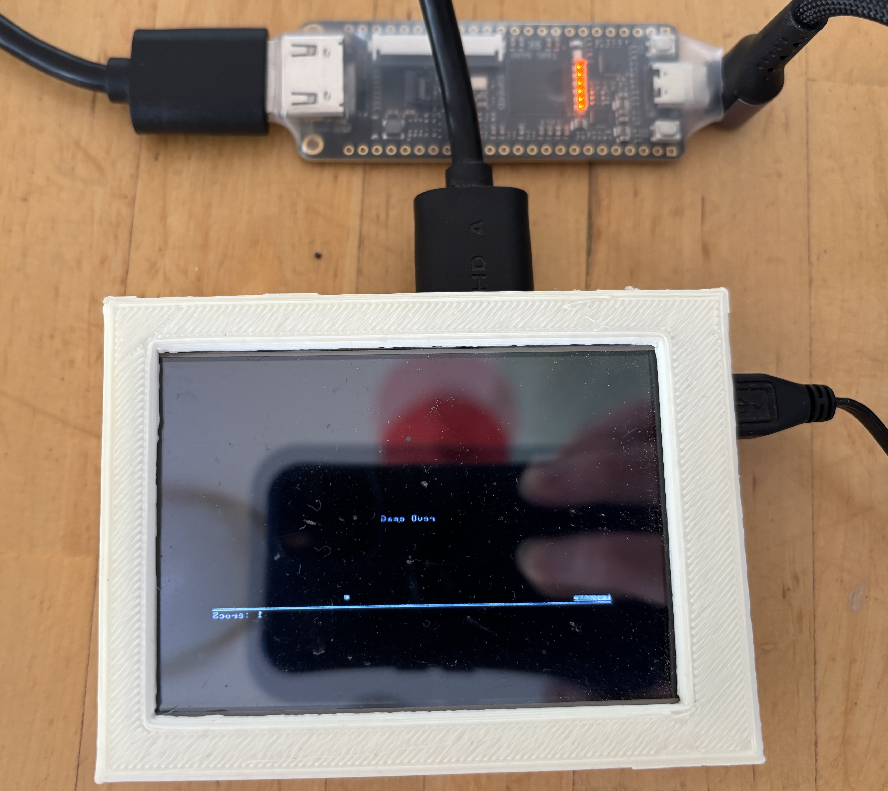

# Hack CPU for Tang Nano 9K FPGA - NAND2Tetris

This is a port of the [nand2Tetris.org]() Hack CPU written in Verilog 
and set up to run on the Tang Nano 9K using GOWIN.

1. [Wikipedia - Hack Computer](https://en.wikipedia.org/wiki/Hack_computer)


## Differences from Hack Computer

1. *Pipelined CPU*: CPU supports stalling to wait for instructions from FLASH or reads from BRAM
2. *FLASH ROM*: ROM moved to FLASH
3. *BRAM*: RAM written in such a way to enure BRAM is used
4. A striped test screen is displayed until the program is loaded

## FPGA Utilization

| Resource | Used | Available | Utilization | Notes |
| --- | ---: | ---: | ---: | --- |
| Logic | 670 | 8640 | 8% | See `LUT` & `ALU` |
| LUT | 563 | - | - | `295` HDMI |
| ALU | 107 | - | - | `69` HDMI |
| Registers | 227 | 6693 | 4% | `226` logic FF, `1` I/O FF |
| CLS | 455 | 4320 | 11% | Configurable logic slices |
| BSRAM | 24 | 26 | 93% | `16 SP`, `8 DPB` (BRAM) |
| FLASH608K | 55KiB | 76KiB | 72% | User flash (Pong) |
| I/O ports | 22 | 71 | 31% | `8 `inputs, `14` outputs |
| I/O buffers | 18 | - | - | `8` input, `10` output, `0` inout |
| IOLOGIC | 8 | 97 | 9% | `4` OSER10 |
| LEDs | 6 | 6 | 100% | `led[5:0]` For CPU debug |
| Buttons | 7 | 7 | 100% | `btn1`, `btn2`, `space`, `enter`, `backspace`, `left`, `up` |
| HDMI | 8 | 8 | 100% | 4 differential pairs: clock plus 3 data lanes |

## Specs

All driven by the resources on the FPGA.

|  |  |  |
| --- | --- | --- |
| Speed | 27Mhz |  |
| RAM | 15KB |  |
| FLASH | 76KB |  |
| Display | 512x256  | Centered on 640x480  |


# Hack CPU that su

## Storage

The users hack program is loaded from user flash.

## Memory

| Address range | Device | Notes |
| --- | --- | --- |
| `0x0000`-`0x3FFF` | RAM | 15KB |
| `0x4000`-`0x5FFF` | Screen | 8KB: 512 x 256 monochrome framebuffer |
| `0x6000` | Keyboard | Button/key input |


## Prerequisites

1. [YosysHQ OSS CAD Suite](https://github.com/yosyshq/oss-cad-suite-build)
2. [GOWIN FPGA Designer](https://www.gowinsemi.com/en/support/download_eda/)


## Build

```
make bitstream
```

## Simulate / Test Bench

```
make sim_all
```

## Make a Movie

Using the test bench/sim we can can skip the HDMI and sample the framebuffer 
memory and create amovie from it to run the CPU and see that it's working.


> WARNING: Command takes up to 10 minutes!

```
make movie
```

## Flash FPGA & Hack App

To save the bitstream and program (pong) to the FPGA & user flash memory:
```
make flash
```


## FPGA Wiring



## Debug LEDs

The board LEDs are active-low, so a lit LED means the internal debug bit is `1`.

| LED | Signal | Meaning when lit |
| --- | --- | --- |
| `led[5]` | `reset_released_seen` | CPU reset has been released |
| `led[4]` | `rom_seen` | Flash ROM returned at least one valid word |
| `led[3]` | `nonzero_instruction_seen` | ROM returned a nonzero instruction, so flash is not blank or zero |
| `led[2]` | `pc_moved_seen` | CPU program counter advanced past `0` |
| `led[1]` | `mem_write_seen` | CPU performed any memory write |
| `led[0]` | `screen_write_seen` | CPU wrote to screen memory `0x4000`-`0x5FFF` |
